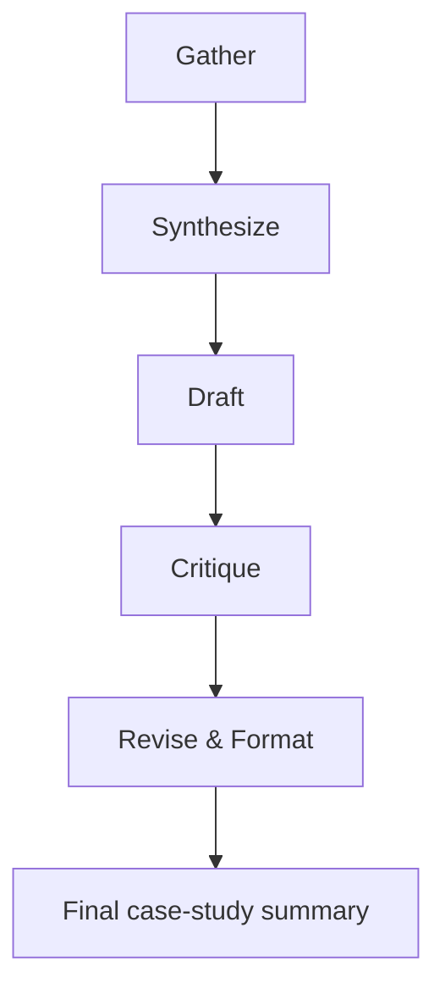

# Walkthrough

## Step diagram



## Prompt and configuration used

- Prompt set:
  - [automation-workflow/prompts/gather.md](prompts/gather.md)
  - [automation-workflow/prompts/synthesize.md](prompts/synthesize.md)
  - [automation-workflow/prompts/draft.md](prompts/draft.md)
  - [automation-workflow/prompts/critique.md](prompts/critique.md)
  - [automation-workflow/prompts/revise-format.md](prompts/revise-format.md)
- Workflow guide: [automation-workflow/WORKFLOW.md](WORKFLOW.md)
- Input template: [automation-workflow/README.md](README.md)

## Run summary

| Run | Output status | Notes |
| --- | --- | --- |
| MuseForge | Complete | Uses placeholder language because no verified facts are present in the repository. |
| TaskFlow / FlyRank frontend capstone | Complete | Uses repository-backed facts about the Next.js capstone and route structure. |
| DeckFlow DJ app | Complete | Uses a cautious placeholder summary because evidence is insufficient. |
| Campus Opportunity Aggregator | Complete | Uses a cautious placeholder summary because evidence is insufficient. |
| AutoFrame3D | Complete | Uses a cautious placeholder summary because evidence is insufficient. |

## Time accounting

The timing below is a planning estimate and not a measured stopwatch result.

- Manual baseline: 20-35 minutes per case-study summary when a human must gather facts, draft, and revise from scratch.
- Automated workflow time: about 10-15 minutes for the structured pipeline once the input is prepared, assuming the user still reviews the output.
- Workflow setup time: about 5-10 minutes to open the prompt files, copy the input template, and run the stages in order.
- Important note: these timings are estimates only and should not be presented as observed measurements.

## Known failure points

- The workflow can still produce weak output if the input notes are vague.
- It may overuse caution and become underdeveloped if the evidence is thin.
- Human review is still needed to verify whether the final wording is appropriate for the target portfolio.

## What a human must still verify

- Whether the facts are truly supported by the source material.
- Whether the wording is appropriate for the intended audience.
- Whether the summary should be published as-is or refined further.
- Whether any missing details should be collected before the case study is shared.

## Fresh-input test

A sixth unseen input can be handled by copying the same template and filling in the new project details:

```md
Project name:
Source notes:
Verified facts already available:
Links or references:
Audience:
Constraints:
Missing information:
```

The workflow then runs through the same five stages and returns a final summary with a factual-confidence checklist.

## Conclusion

The workflow saves time by providing a repeatable structure for gathering facts, drafting a summary, and checking for unsupported claims. It does not remove the need for human judgment, especially when the source material is incomplete or the project details are still being confirmed.
