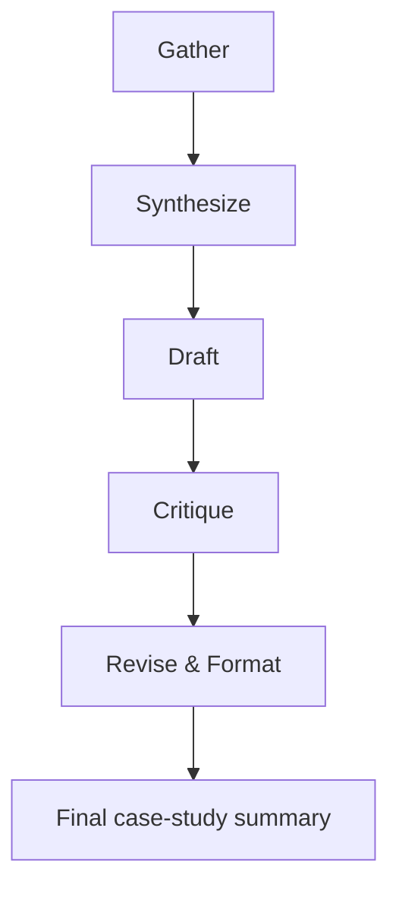

# Workflow: From Notes to Case Study

## Overview

This five-stage pipeline converts raw project notes into a concise case-study summary while preserving factual discipline.



## Stage 1: Gather

Goal: extract only the supplied facts, audience, constraints, and missing information.

Input:
- project name
- source notes
- verified facts
- links or references
- audience
- constraints
- missing information

Output:
- a structured fact list
- audience and constraints summary
- a missing-information list

## Stage 2: Synthesize

Goal: organize the material into problem, contribution, technical decisions, challenge, and outcome.

Input:
- gathered facts and missing-information list

Output:
- a concise synthesis with clearly separated sections

## Stage 3: Draft

Goal: write a recruiter-facing case-study summary that remains grounded in evidence.

Input:
- synthesis output

Output:
- a first draft summary

## Stage 4: Critique

Goal: detect unsupported claims, vague wording, repetition, missing evidence, and AI-sounding language.

Input:
- first draft

Output:
- critique notes and a list of necessary edits

## Stage 5: Revise & Format

Goal: apply the critique and return the final version plus a factual-confidence checklist.

Input:
- critique notes and draft

Output:
- revised final summary
- factual-confidence checklist

## Handoff format

Each stage should return a compact structure like this:

```md
Stage: gather
Input: [summary of input]
Output:
- Facts:
- Audience:
- Constraints:
- Missing information:
```

## Guardrails

- Never invent metrics or achievements.
- If a fact is not supported, mark it as "Needs confirmation".
- Keep the writing concise and transparent.
